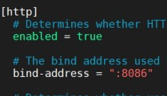
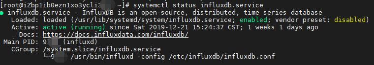
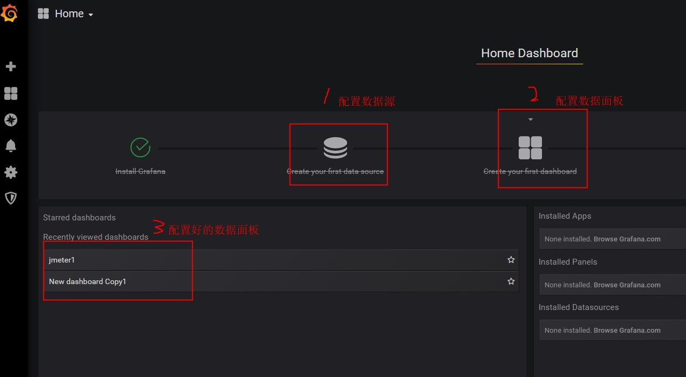
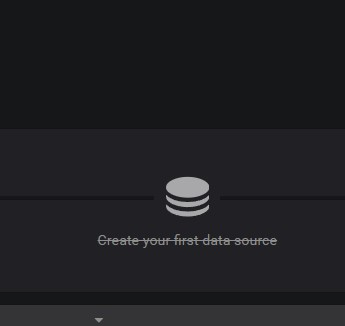
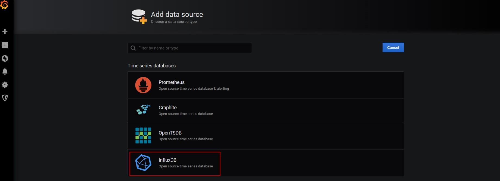
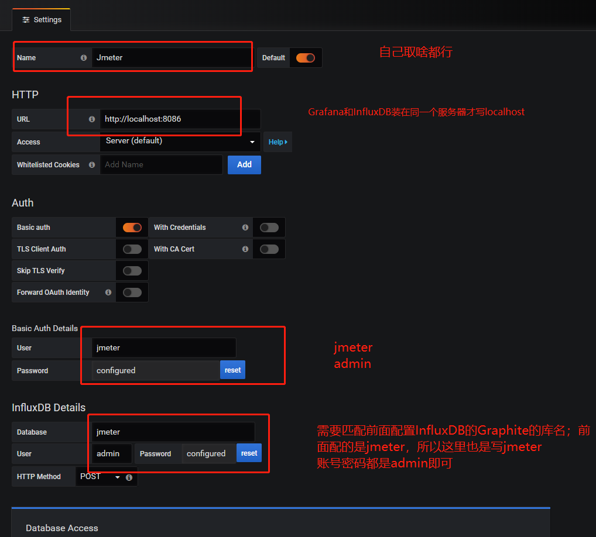
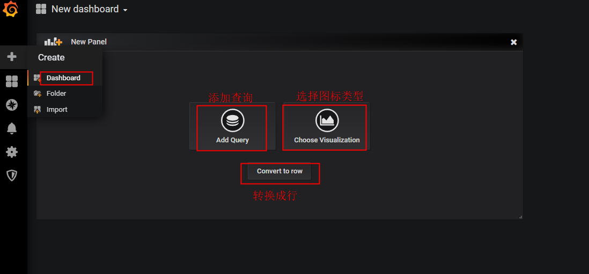
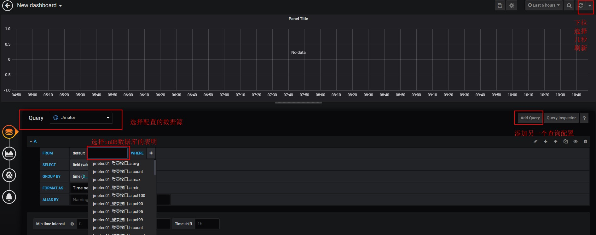
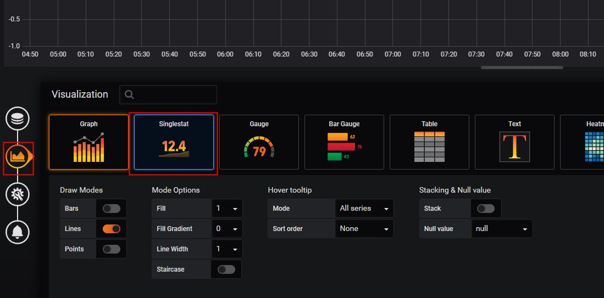

## 搭建容器
> 拉取CentOS7镜像，下载安装Grafana和Influxdb

    
        # 拉取阿里云的centos7镜像
        git pull registry.cn-zhangjiakou.aliyuncs.com/ggls/centos:7.1
        # 运行镜像生成容器
        docker run -itd --name centos7-influx 
        -p 8083:8083 -p 8086:8086 
        -p 2003:2003 -p 3000:3000 
        -v /opt/centos7_influx:/opt 
        --privileged=true 
        registry.cn-zhangjiakou.aliyuncs.com/ggls/centos:7.1 /usr/sbin/init
        # 进入容器
        docker exec -it centos7-influx bash
    

端口说明：
+ 8083：InfluxDB的UI界面展示的端口
+ 8086：Grafana用来从数据库取数据的端口
+ 2003：Jmeter往数据库发数据的端口
+ 3000：本地访问服务器内部docker容器的端口


## 安装Influxdb

1. 下载influxDB


新版本可以点击[influxDB官网](https://portal.influxdata.com/downloads/)进行下载


    # 下载安装包
    wget https://dl.influxdata.com/influxdb/releases/influxdb-1.6.3.x86_64.rpm
    # 安装运行
    yum localinstall influxdb-1.6.3.x86_64.rpm



2. influxDB配置

安装运行后,然后对influxDB进行配置，主要是配置Jmeter连接的数据库和端口号


    vim /etc/influxdb/influxdb.conf


找到`graphite`并且修改它的库与端口
```python
    enabled = true
    database = "jmeter"
    retention-policy = ""
    bind-address = ":2003"
    protocol = "tcp"
    consistency-level = "one"
```
3. 找到`[http]`，将前面的#号去掉

<figure>
	<a href="../assets/img/2022-08-25-监控性能平台.assets/Dingtalk_20221124172543.jpg"></a>
</figure>

4. 配置成功，启动influxDB

+ 启动命令： `systemctl start influxdb.service`
+ 查看状态命令： `systemctl status influxdb.service`

<figure>
	<a href="../assets/img/2022-08-25-监控性能平台.assets/1896874-20191230134907488-2036030566.png"></a>
</figure>

## 安装Grafana

新版本下载位置：Grafana官网下载：https://grafana.com/grafana/download

```python
wget https://dl.grafana.com/oss/release/grafana-6.5.2-1.x86_64.rpm

sudo yum localinstall grafana-6.5.2-1.x86_64.rpm
```
#### 然后启动

启动命令： `systemctl start grafana-server.service` 

查看状态命令： `systemctl status grafana-server.service`

然后在浏览器访问登录`http://ip:3000`；

## 配置Jmeter

### 一、添加监听器：Backend Listener

+ 右键点击`Thread Group`
+ 点击`Add -> Listener -> Backend Listener`

### 二、配置监听器：Backend Listener

Backend Listener implementation 默认选择GraphiteBackendListenerClient 

+ graphiteHost：InfluxDB安装的服务器的ip
+ graphitePort：端口；默认就是2003，除非你自己安装InfluxDB时设置了其他端口是哦（可见上面安装InfluxDB后关于graphite的配置）
+ rootMetricsPrefix：指标的根前缀；将测试结果存入数据库时，不同指标会生成不同表，但这些表都最好要有一个共同的前缀，这个就是了；后面会讲到不同的指标的含义（重点哦）
+ summaryOnly：当你线程组有多个请求又想知道每个请求的结果数据时，最好填false，因为true只会返回所有请求的集合数据报告，不会输出每条请求的数据报告
+ samplersList：取样器列表；想收集哪些请求就填哪些，最好用正则去匹配，减轻工作量
+ useRegexpForSamplersList：是否使用正则；如果true则使用，samplersList里可以匹配正则表达式
+ percentiles：百分比；即类似聚合报告里90% Line，95% Line，99% Line的数据；倘若想要99.9时，需要写成【99_9】，用下划线代替点

### 三：运行Jmeter脚本，查看数据库

数据库里面有两个库，jmeter库就是jmeter运行生成表的数据库

可以看到生成了三类前缀的表，分别是： jmeter.all 、 jmeter.[请求名称]；最后还有 jmeter.test 开头的表，这个后面会单独拿出来说

**前缀的含义**
+ `jmeter.all` ：代表了所有请求；当`summaryOnly`=true时，就只有`samplerName`=all的表了
+ `jmeter.[请求名称]`:代表了HTTP请求，即samplerName=[请求名称]


Thread/Virtual Users metrics - 线程/虚拟用户指标
跟线程组设置相关的

指标 | 全称 | 含义
--- | --- | ---
jmeter.test.minAT |	Min active threads | 最小活跃线程数
jmeter.test.maxAT | Max active threads | 最大活跃线程数
jmeter.test.meanAT | Mean active threads | 平均活跃线程数
jmeter.test.startedT | Started threads | 启动线程数
jmeter.test.endedT | Finished threads | 结束线程数

**Response times metrics - 响应时间指标**

划重点：每个sampler(请求)都包含了所有响应时间指标，每个sampler(请求)的每个指标都会有单独的一个表存储结果数据

指标 | 含义
--- | ---
<rootMetricsPrefix><samplerName>.ok.count | sampler的成功响应数
<rootMetricsPrefix><samplerName>.h.count | 服务器每秒命中次数(每秒点击数，即TPS）
<rootMetricsPrefix><samplerName>.ok.min | sampler响应成功的最短响应时间
<rootMetricsPrefix><samplerName>.ok.max | sampler响应成功的最长响应时间
<rootMetricsPrefix><samplerName>.ok.avg | sampler响应成功的平均响应时间
<rootMetricsPrefix><samplerName>.ok.pct<percentileValue> | sampler响应成功的所占百分比
<rootMetricsPrefix><samplerName>.ko.count | sampler的失败响应数
<rootMetricsPrefix><samplerName>.ko.min | sampler响应失败的最短响应时间
<rootMetricsPrefix><samplerName>.ko.max | sampler响应失败的最长响应时间
<rootMetricsPrefix><samplerName>.ko.avg | sampler响应失败的平均响应时间
<rootMetricsPrefix><samplerName>.ko.pct<percentileValue> | sampler响应失败的所占百分比
<rootMetricsPrefix><samplerName>.a.count | sampler响应数(ok.count+ko.count)
<rootMetricsPrefix><samplerName>.sb.bytes | 已发送字节
<rootMetricsPrefix><samplerName>.rb.bytes | 已接收字节
<rootMetricsPrefix><samplerName>.a.min | sampler响应的最短响应时间(ok.count和ko.count的最小值)
<rootMetricsPrefix><samplerName>.a.max | sampler响应的最长响应时间(ok.count和ko.count的最大值)
<rootMetricsPrefix><samplerName>.a.avg | sampler响应的平均响应时间(ok.count和ko.count的平均值)
<rootMetricsPrefix><samplerName>.a.pct<percentileValue> |sampler响应的百分比（根据成功和失败的总数来计算）


### 四、配置Grafana
步骤：

+ 配置数据源

+ 创建数据面板

<figure>
	<a href="../assets/img/2022-08-25-监控性能平台.assets/11.jpg"></a>
</figure>

#### 配置数据源

点击首页的`Create your first data source`,然后进行配置

<figure>
	<a href="../assets/img/2022-08-25-监控性能平台.assets/13.jpg"></a>
</figure>

点击选择`influxDB`

<figure>
	<a href="../assets/img/2022-08-25-监控性能平台.assets/14.jpg"></a>
</figure>

<figure>
	<a href="../assets/img/2022-08-25-监控性能平台.assets/15.png"></a>
</figure>

#### 配置数据面板

<figure>
	<a href="../assets/img/2022-08-25-监控性能平台.assets/16.png"></a>
</figure>

选择`Add Query`,然后进行配置

<figure>
	<a href="../assets/img/2022-08-25-监控性能平台.assets/17.jpg"></a>
</figure>

当我们只想看数据而不想看数据趋势图的话，可以改变它的类型；

在同一个界面，点击左侧列表选中第二个icon，然后选择Singlestat即可

<figure>
	<a href="../assets/img/2022-08-25-监控性能平台.assets/19.jpg"></a>
</figure>

基本的配置完成，Jmeter使用`GraphiteBackendListenerClient`来采集数据的，因为请求多起来的时候会有非常多的表，维护成本也会增加；后面将会介绍如何通过`InfluxDBBackendListenerClient`来采集数据

